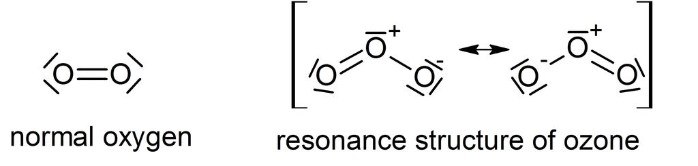
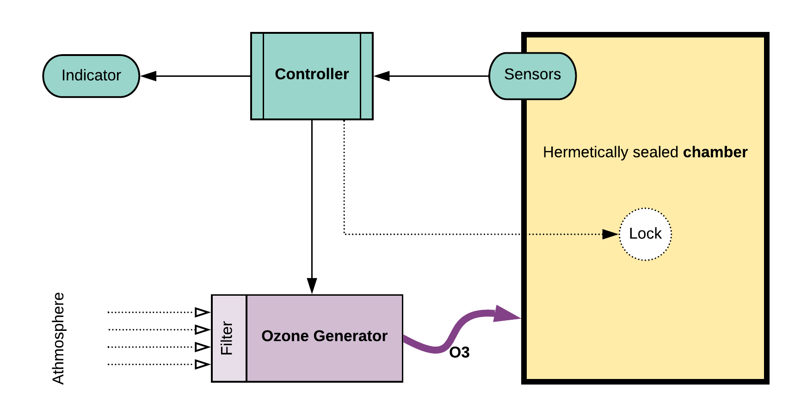
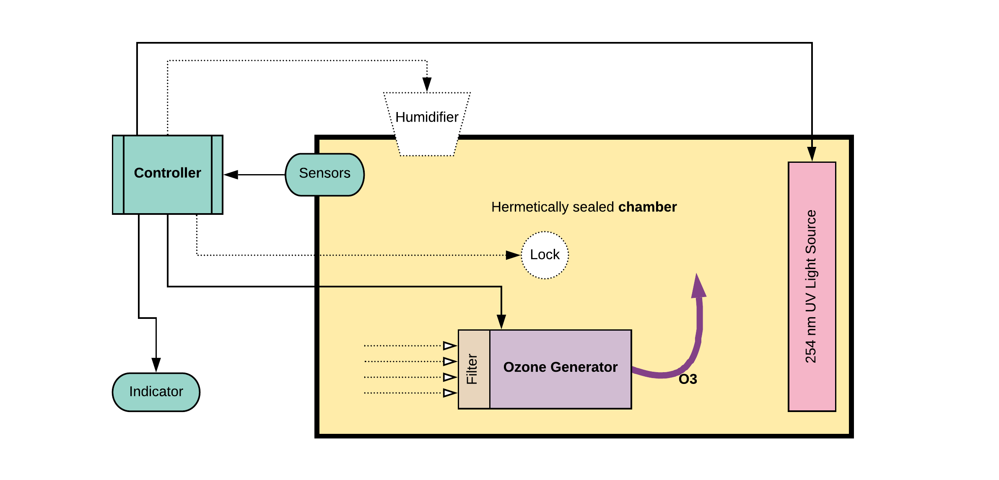
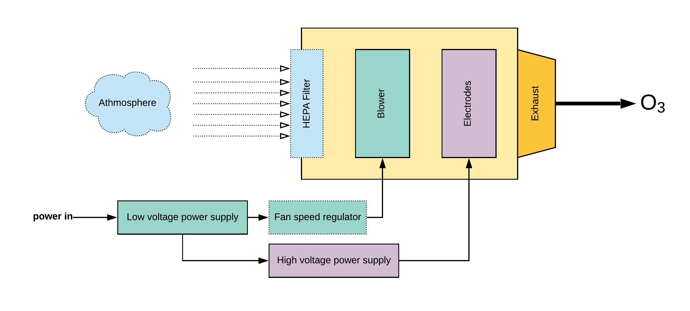
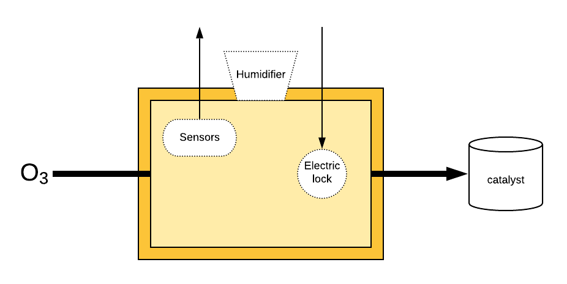
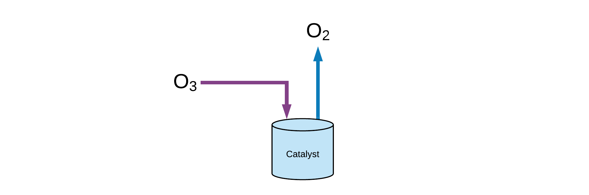
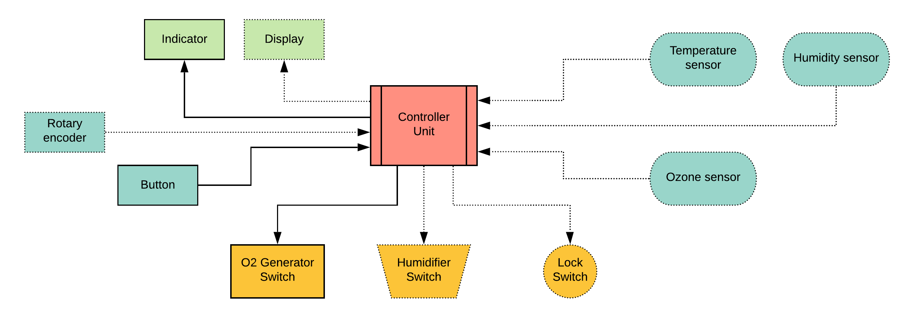

# SMOG-SC / O3 Sterilizer

*Scalable Modular Ozone Generation based Sterilization Chamber ( SMOG-SC )*

This project aims to lay down general design instructions for an ozone generation based sterilization chamber that could be deployed fast to medical environments. The design is layered and modular to take component availability into account.

## About ozone

Ozone (O3) is an unstable gas comprising three atoms of oxygen. It is unstable because the gas will readily degrade back to its stable state, diatomic oxygen (O2) with the formation of free oxygen atoms or free radicals. The free oxygen atoms or radicals are highly reactive and they will oxidize almost anything  including viruses, bacteria, organic and inorganic compounds) in contacts, making ozone an enormously powerful disinfectant and oxidizer. 

:warning: **Ozone with concentration higher than 1 ppm has adverse effects on human health and the use of ozone for air disinfection is generally not recommended if people are around.** :warning:

The MAC-value is the Maximum Acceptable Concentration a human is allowed to be exposed to for a certain time and certain agent. For ozone the MAC-values is **0.06 PPM for 8 hours a day, 5 days a week** (PPM = Parts Per Million). For a maximum of 15 minutes a MAC-value of 0.3 PPM is applied.

Read more: https://www.lenntech.com/library/ozone/decomposition/ozone-decomposition.htm

| **Temp (°C)** | Half live   |
| ------------- | ----------- |
| -50           | 3 months    |
| -35           | 18 days     |
| -25           | 8 days      |
| 20            | 3 days      |
| 120           | 1,5 hours   |
| 250           | 1,5 seconds |

**Dissolved in water (pH 7)**

| **Temp (°C)** | **Half** **live** |
| ------------- | ----------------- |
| 15            | 30 min            |
| 20            | 20 min            |
| 25            | 15 min            |
| 30            | 12 min            |
| 35            | 8 min             |

* Ozone breaks down to oxygen with a half life of about 20 minutes ( at 20 degrees Celsius in water )
* Decomposition of 2 mol (96 g) ozone to 3 mols of oxygen requires 286 kJ energy
* pH influences acid/base equilibriums of some compounds and also the reaction speed of ozone.
* Decay of ozone in a basic environment is much faster than in an acid environment!
* [Materials ozone resistance chart](https://www.oxidationtech.com/blog/materials-ozone-resistance-chart/)
* [Ozone decomposition kinetics](doc/Ozone_decomposition_kinetics.pdf)

## Decontamination protocol

The standard program adopted involves increasing the ozone level over a period of 15 min to 25 ppm, maintaining this level for 10 min, at which point the humidifier was activated to produce a rapid burst of water vapor. This should result in the RH increasing to > 95% within 5 min. Following this the humidifier and generator are switched off and the catalytic converter is switched on, which results in decrease in ozone to < 1 ppm within 15 min. [Hudson et al.](doc/Ozone_Science_and_Engineering_Pub_Jan091.pdf)

## Device requirements

* Hermetically sealed sterilization chamber *( when door is closed )*
* Effective minimum concentration of ozone is 25 ppm **~50 mg/m3** *( 1 ppm (O3) = 2.14 mg/m3 )*
* To meet protocol parameters **for every cubic meter** a generator capacity of **~200 mg/h** is required.
* Air humidity shall be controlled so that RH could be increased to **> 95%** rapidly. *( optional )*
* There should be a **timed lock**, to prevent the user to open the device while operating. *( optional )*
* There should be a clear **sign** indicating potentially dangerous oxidant levels inside the device.
* Ozone **levels** should be either measured or predicted by its decomposition model.
* Temperature and humidity can be easily monitored. *( supporting the level prediction - optional )*

## System block diagram

:warning: **Note**: this design is only recommended in emergency situations, where sufficient ventilation of the room can be provided!

The whole system can be either completely closed, or partially open, where the ionized air can travel through the chamber into a catalyst. For the sake of simplicity we recommend building the closed system with the <u>generator inside the sterilization chamber</u>.

Either way the sterilizer system consists of four separate modules that can be <u>bought or built</u>:

* The **generator** is turning atmospheric oxygen into ozone enriched air.
* The ozone enriched air is pumped into a sealed **chamber**. 
* The **decomposer** that helps to break down ozone to oxygen.
* The **controller** is regulating the sterilization process.

#### Open system

#### Closed system

### [Ozone generator](doc/ozone_generator.md)

A coronal discharge method based generator consists of:

* HEPA filter on the atmospheric air intake port *( optional )*
* A fan or blower that moves the air volume along the electrodes. *( AC or low voltage DC )*
* The electrodes or *"ozone plates"* provide surface for the corona discharge. *( ceramic )*
* A high voltage power supply ( output **~3.5kV / 30mA** ) is required to drive the plates.
* Exhaust port to channel the O3 enriched air into an ozone resistant tube.

### [Sterilization chamber](doc/steril_chamber.md)

* The chamber has to be somewhat airtight as the ozone is harmful to humans as well.
* Ozone, temperature and humidity sensors has to be placed inside.
* Ideally an electric lock should block the door.

### [Decomposer](doc/catalizator.md)

Ozone can be reduced to oxygen **thermally** or **catalytically** or **by radiation**. 

*In case of a closed system:*

* The chamber has to hold light sources at **254 nm** wavelength with sufficient power to disrupt the instable bonds in ozone molecules.

*In case of an open system:*

* The ozone enriched air from the chamber has to be able to enter the decomposer.
* In case of catalytic destruction the decomposer could be a bucket of tap water.
* If the pH can be controlled, basic environment is preferable. *( Pka  = 10,3 )*
* Thermal decomposition is effective if the air flows through a tube heated to **250 C** *( HL = 1.5s )*

### [Process controller](doc/controller.md)

*  In it's simplest form this could be a **timer switch**. *( either the generators built-in timer or an external )*
*  Also there are ready made [ozone controllers](http://www.iaq.hu/F2077TSM-O3%20ozontavado.pdf) with relay outputs.

**Otherwise a controller could consist of:**

*  MCU chip or board *( general programmable micro controller board e.g. Nucleo or Arduino )*
* Temperature sensor to support the decomposition model.
* Humidity sensor to check protocol requirements are met.
* Ozone sensor as control feedback and to check protocol requirements.
* Optional user interface *( Small OLED display and rotary encoder )* for setting chamber parameters
* Single button to start / stop sterilization process.
* Process indicator *( e.g. large LED )*
* Interfaces to control the ozone generator, humidifier and lock. *( e.g. solid state relays )*

## Build instructions

### Closed system assembly

:warning: If time is a factor and there is opportunity to vent the room after each sterilization process we recommend building the fully closed system design *( although it is bad for the environment )*.

**Fastest way:**

* Get a refrigerator of desired size and place an off the shelf ozone generator in it.
* Use our [volume to treatment time converter tool](http://nowtech.cloud/closed_calc.html) to figure out the timing protocol.
* Plug the system in, through a ready made AC timer switch.
* Follow the [instructions here](doc/ver_emergency.md).

### Open system assembly

:warning: It is highly advised for medical environments to build a device with an ozone decomposer to prevent unnecessary ozone accumulation in the building.

* A hermetic chamber or a modified refrigerator.
* An off-the-shelf or a DIY ozone controller.
* An off-the-shelf or a DIY decomposer.

* Follow the build [instructions here](). :construction:

### How to build the missing ozone generator

* If an off-the-shelf generator is not available:
  * Here is how to [build it from modules](doc/ozone_generator.md). 
  * And if you can't find modules anymore here is how to [build it from components](doc/ozone_generator.md).
* Also detailed information on [how to create the electrodes](doc/electrodes.md) itself.
* Generator [capacity measurement instructions](doc/capacity.md).

### Build instructions for the control unit

* Worst case scenario the process controller is the "timer switch" on the generator.
  * If the generator is built from modules or scratch [add a timer switch](doc/ots_controller.md).​
* Continuous operation requires more sophisticated control with sensor feedback:
  * Find a controller that has been manufactured for this purpose, or
  * follow this link to [build a process controller](doc/diy_controller.md).:construction: