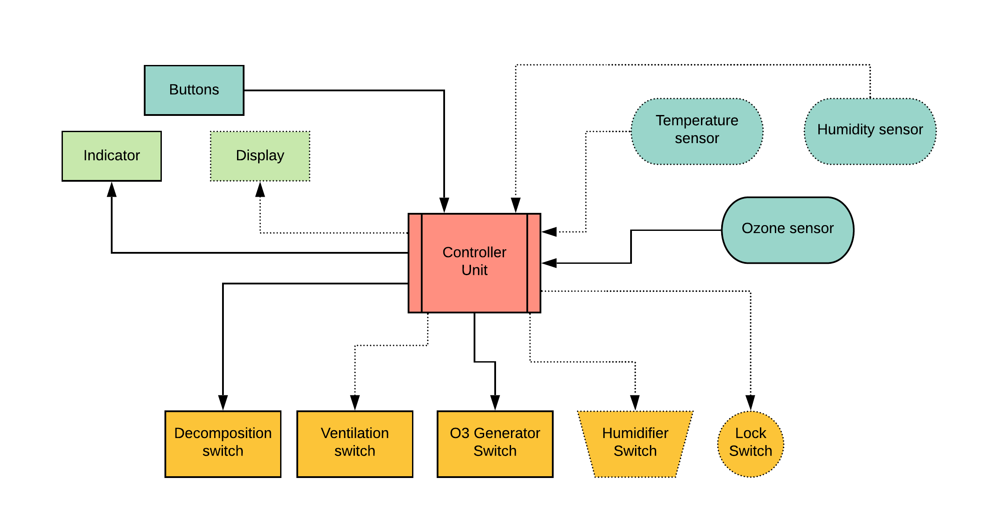

# SMOG-SC / O3 Sterilizer

*Scalable Modular Ozone Generation based Sterilization Chamber ( SMOG-SC )*

This project aims to lay down general design instructions for an ozone generation based sterilization chamber that could be deployed fast to medical environments. The design is layered and modular to take component availability into account.

### About ozone

Ozone (O3) is an unstable gas comprising three atoms of oxygen. It is unstable because the gas will readily degrade back to its stable state, diatomic oxygen (O2) with the formation of free oxygen atoms or free radicals. The free oxygen atoms or radicals are highly reactive and they will oxidize almost anything  including viruses, bacteria, organic and inorganic compounds) in contacts, making ozone an enormously powerful disinfectant and oxidizer. 

:warning: **Ozone with concentration higher than 1 ppm has adverse effects on human health and the use of ozone for air disinfection is generally not recommended if people are around.** :warning:

* Ozone breaks down to oxygen with a half life of about 20 minutes ( at 20 degrees Celsius )
* Decomposition of 2 mol (96 g) ozone to 3 mols of oxygen requires 286 kJ energy
* [Materials ozone resistance chart](https://www.oxidationtech.com/blog/materials-ozone-resistance-chart/)

### Sterilization protocol

The standard program adopted involves increasing the ozone level over a period of 15 min to 25 ppm, maintaining this level for 10 min, at which point the humidifier was activated to produce a rapid burst of water vapor. This should result in the RH increasing to > 95% within 5 min. Following this the humidifier and generator are switched off and the catalytic converter is switched on, which results in decrease in ozone to < 1 ppm within 15 min. [Hudson et al.](doc/Ozone_Science_and_Engineering_Pub_Jan091.pdf)

### Device requirements

* Hermetically sealed sterilization chamber *( when door is closed )*
* Effective minimum concentration of ozone is 25 ppm **~50 mg/m3** *( 1 ppm (O3) = 2.14 mg/m3 )*
* To meet protocol parameters **for every cubic meter** a generator capacity of **~200 mg/h** is required.
* Air humidity shall be controlled so that RH could be increased to **> 95%** rapidly. *( optional )*
* There should be a **timed lock**, to prevent the user to open the device while operating. *( optional )*
* There should be a clear **sign** indicating potentially dangerous oxidant levels inside the device.
* Ozone **levels** should be either measured or predicted by its decomposition model.
* Temperature and humidity can be easily monitored. *( supporting the level prediction - optional )*

### System block diagram

This sterilizer system consists of three separate modules that can be <u>either bought or built</u>:

* The **generator** is turning atmospheric oxygen into ozone enriched air.
* The ozone enriched air is pumped into a sealed **chamber**. 
* The **controller** is regulating the sterilization process.

#### [Ozone generator](doc/ozone_generator.md)

A coronal discharge method based generator consists of:

* HEPA filter on the atmospheric air intake port *( optional )*
* A fan or blower that moves the air volume along the electrodes. *( AC or low voltage DC )*
* The electrodes or *"ozone plates"* provide surface for the corona discharge. *( ceramic )*
* A high voltage power supply ( output **~3.5kV / 30mA** ) is required to drive the plates.
* Exhaust port to channel the O3 enriched air into an ozone resistant tube.

#### [Sterilization chamber](doc/steril_chamber.md)

* The chamber has to be somewhat airtight as the ozone is harmful to humans as well.
* There has to be a way to let the ozone flow tube in.
* Ozone, temperature and humidity sensors has to be placed inside.
* Ideally an electric lock should block the door.

#### [Process controller](doc/controller.md)

*  MCU chip or board *( general programmable micro controller board e.g. Nucleo or Arduino )*
* Temperature sensor to support the decomposition model.
* Humidity sensor to check protocol requirements are met.
* Ozone sensor as control feedback and to check protocol requirements.
* Optional user interface *( Small OLED display and rotary encoder )* for setting chamber parameters
* Single button to start / stop sterilization process.
* Process indicator *( e.g. large LED )*
* Interfaces to control the ozone generator, humidifer and lock. *( e.g. solid state relays )*

