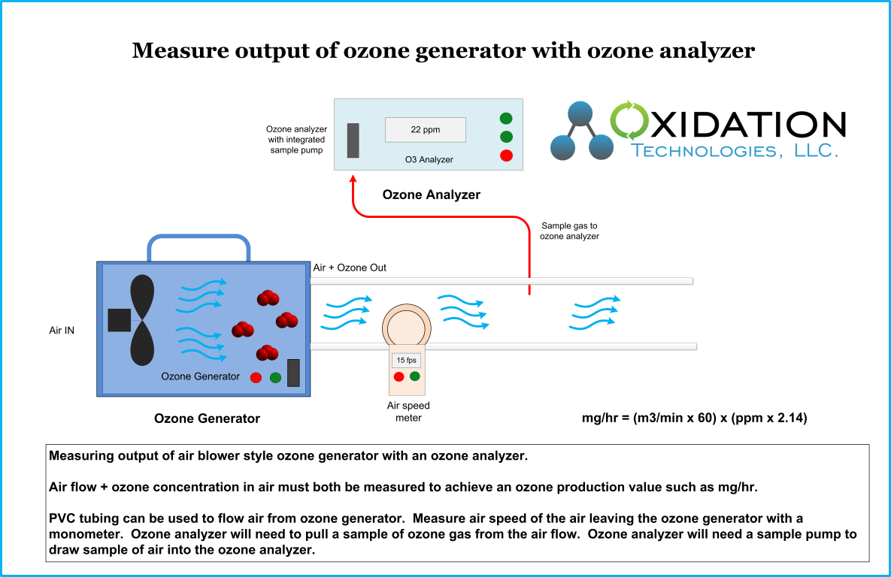
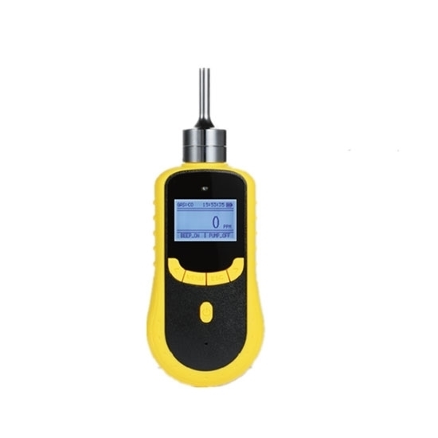
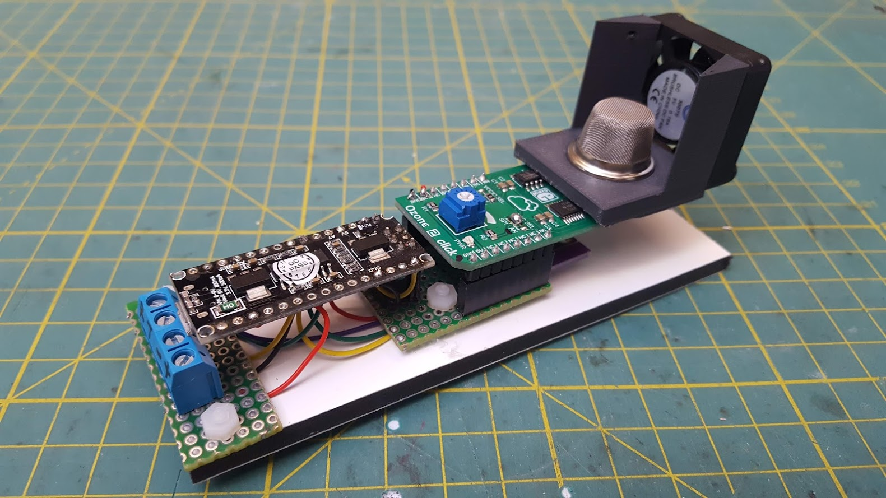
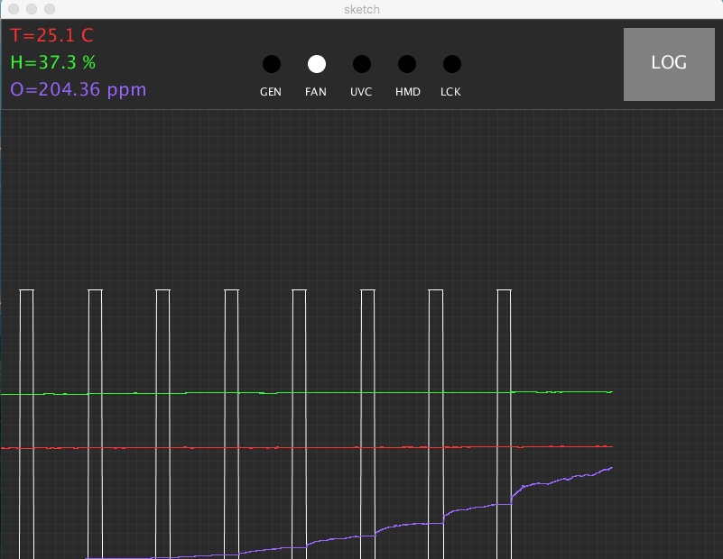

# Determining generator capacity

For detailed description of different methodologies please read the article of *Kerwin Rakness* on **Guideline for Measurement of Ozone Concentration in the Process Gas From an Ozone Generator** [here](Ozone_measurement.pdf).

Follow [Oxidation Technologies Measurement protocol](https://www.oxidationtech.com/ozone/ozone-production/how-to-test-production-from-your-ozone-generator/test-o3-output-commercial.html):

An **ozone meter** will be required to measure ozone concentration in the air leaving the ozone generator. This must have a sample pump to draw a sample of gas from your flow tube into the monitoring device. This will provide the most accurate ozone measurements without disrupting your air flow. Ideally a UV based ozone analzyer will be used to measure ozone levels due the greater precision and accuracy available. However, there are some ozone meters available using electrochemical or HMOS sensor cells that can pull a gas sample into the sensor and provide reasonable accuracy. For the best accuracy in ozone production choose the most accurate ozone meter possible.

The specific ozone analyzer we recommend to use for this testing is the [UV-100 Ozone Analyzer.](https://www.oxidationtech.com/products/ozone-monitors/uv-analyzer/uv100-ozone-analyzer.html) This is available[ for sale](https://www.oxidationtech.com/products/ozone-monitors/uv-analyzer/uv100-ozone-analyzer.html), or [for rent for shorter term needs.](https://www.oxidationtech.com/products/rent-ozone/uv-100-rental.html)

A **Monometer** is used to measure airflow by measuring the velocity of airflow in your flow tube. A digital monometer can be obtained that will measure airflow in a variety of units of measure. For the best accuracy in ozone production choose the most accurate monometer possible.

A **Flow Tube** must be constructed to measure airflow from the ozone generator. This tube can be constructed of PVC or other plastic materials. The airflow from the ozone generator must have as much turbulence removed as possible to accurately measure air speed. This tube must be sealed directly to the outlet of the ozone generator and must not restrict air flow in any way. Actual air flow of the ozone generator in normal operation must be obtained and measured accurately.

## Ozone meters

Simplest way to determine the capacity of a generator is with a calibrated measurement unit, such as this:

* Typical range 10 ppm - 1000 ppm
* Price 250 - 1500 EUR

## Open ozone sensor + PC GUI

#### [OO/Sensor](https://github.com/nowtechnologies/open_ozone_sensor)

* Typical range 10 ppm - 1000 ppm
* Price <50 EUR

#### [OO/Monitor](https://github.com/nowtechnologies/open_ozone_monitor)

