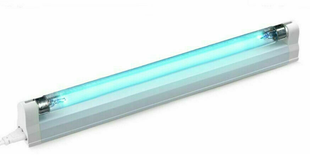
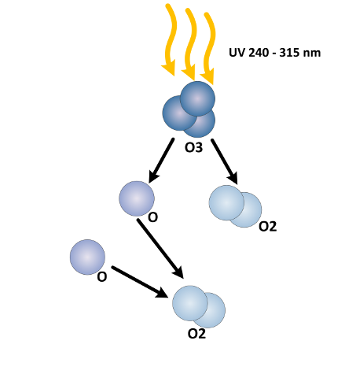
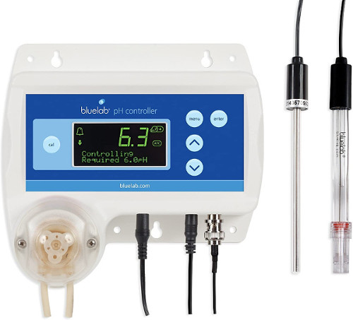
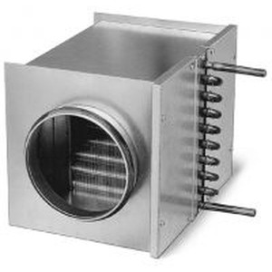

# Ozone destruction methods

## Ultraviolet light

## pH regulated water solutions

## Extreme heat

| **Temp (°C)** | Half life   |
| ------------- | ----------- |
| -50           | 3 months    |
| -35           | 18 days     |
| -25           | 8 days      |
| 20            | 3 days      |
| 120           | 1,5 hours   |
| 250           | 1,5 seconds |
