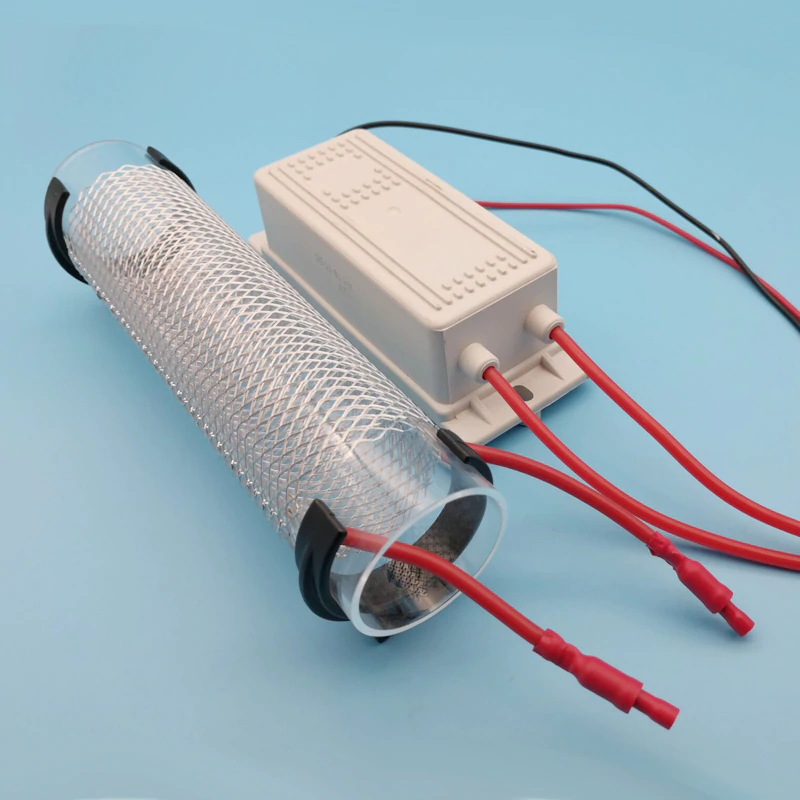

# Electrode alternatives

* Glass sheet or tube with aluminum wire structures on both sides
* Sheets of stainless steel with saw forming edges *( arc gap on the edges )*
* Double sided printed circuit board  *( Preferably aluminum base layer )* 

## Glass tube

