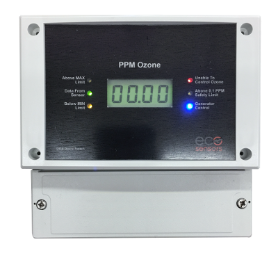
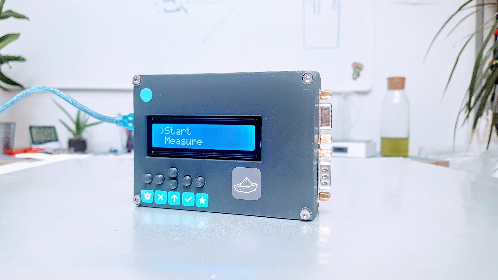

# Process controller

## Ozone controllers

https://www.ecosensors.com/product/os-6-ozone-controller-data-sheet/

The OS-6 is an industrial grade ozone controller and monitor. The OS-6 design has been optimized for accuracy, ease of installation, setup and operation. The OS-6 is only available with the SM-7/SM-EC in two different concentration ranges.

**Features:**

- Industrial strength, water resistant enclosure.
- Large digital display, auto-ranging (0-50ppm) w/ backlight.
- Easy front panel access to set points and relays.
- Precisely adjustable max, min, and fail time set points.
- Failure alarm if ozone remains outside control range.
- Front panel generator control cutoff switch for easy maintenance.
- User selectable PPM ranges for analog output (4-20 mA and 0-2 VDC)
- OSHA 0.1 ppm safety limit light.

## Open Ozone Controller

[Github project](https://https://github.com/nowtechnologies/open_ozone_controller)

