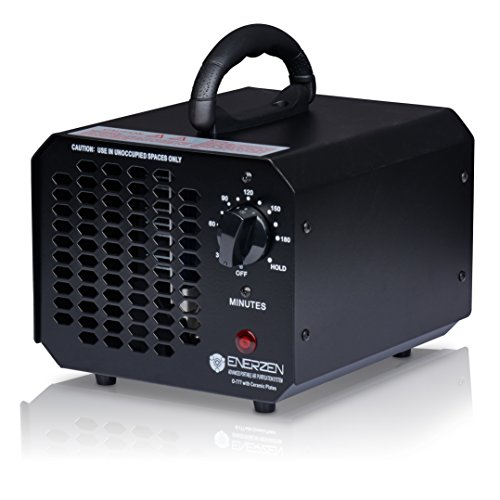
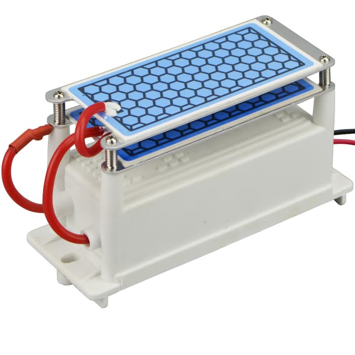
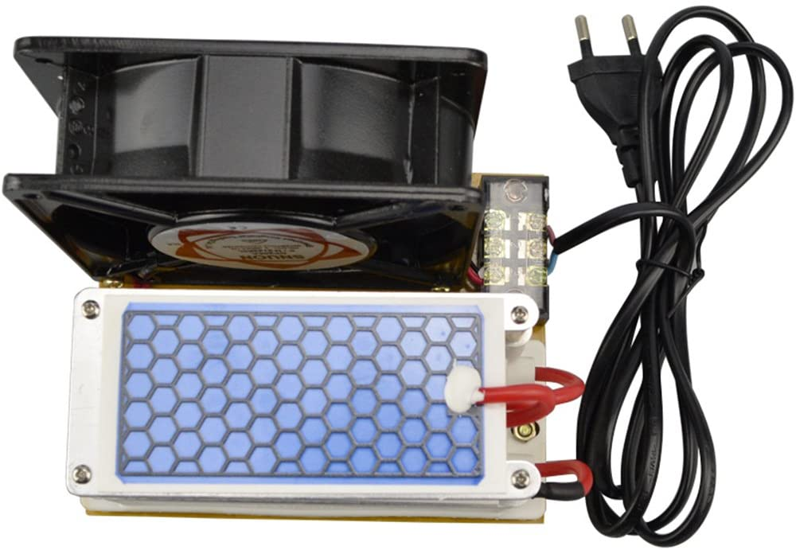
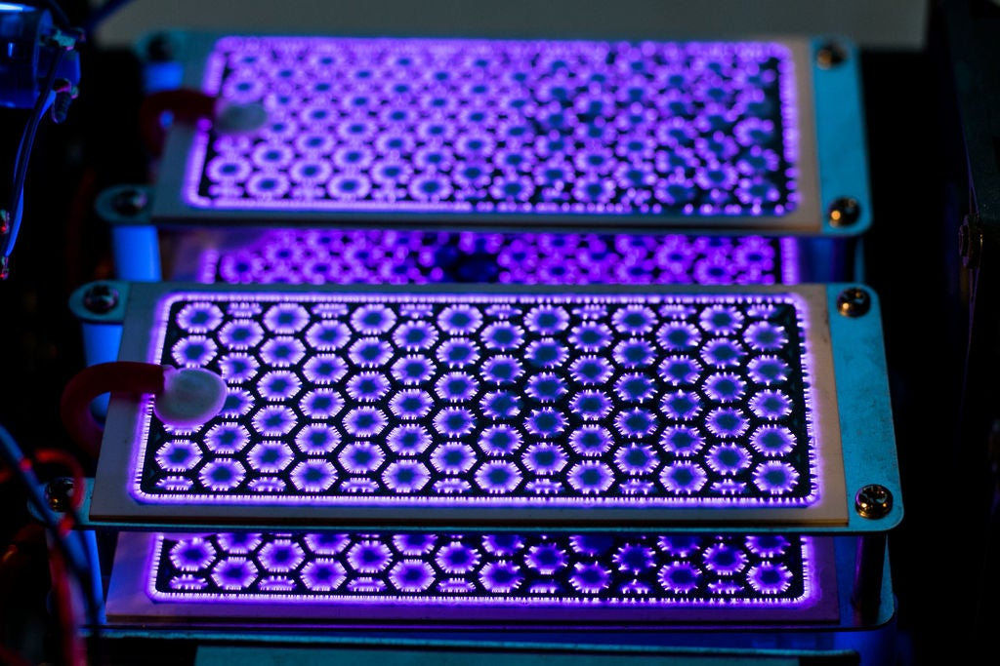
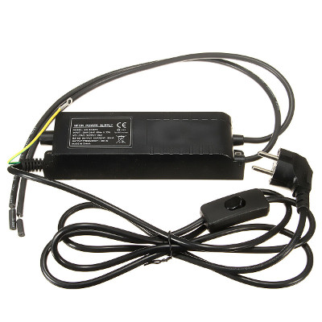

# Ozone generator

## Off the shelf generators

Room and car air purifiers can meet the requirements if we take into consideration that **for every cubic meter** a generator capacity of **~200 mg/h** is required. Mid-sized generators for homes produce between 2.5 - 10 grams / hour.

#### Advantages

* Fastest way to start with. *( Put it in a closed chamber and turn it on for n minutes. )*
* It has been built and tested.
* It has the capacity to sterilize a complete room. *( 5-10 g/h )*
* The indicator and timer is already built in. *( also potential disadvantage )* 

#### Disadvantages

* Price range can vary from 100-1000 EUR.
* It runs only from AC. *( battery operation requires disassembly or an inverter )*
* There might be some difficulties with the supply chain.

## Ozone generator modules

Generator modules come in different shapes and sizes, the most frequent types are based on ceramic plate electrodes. These modules also easily met the minimum capacity requirements. As a thumb rule one plate *( ~100x50mm )* can produce ~5 g/h ozone. The modules can be either DC or AC powered by type.

#### Advantages

* Fairly fast way to start with.
* Functional module, already tested.
* More then enough capacity.
* Easy to scale up.
* Easy to control.
* Fair price *( as of know ~30 EUR for a 10 g/h module )*

#### Disadvantages

* All the other components needs to be built around it. 
* There might be some difficulties with the supply chain. *( as produced in China )*

#### Simple generator configuration

The most easy to assemble setup for a functional generator is to an AC fan ( ~100 CFM = ~170 m3/h ) with an AC generator module:

## Generator module from scratch

At a pinch the generator can be built from electronic modules and the modules from simple components:

* Ozone plates / electrodes

* High voltage power supply *( HV-PSU )*

  

### Electrodes

The electrodes are the **critical parts** of a generator as the instable ozone molecules are formed when the atmospheric oxygen molecules are forced into a higher energy state by the corona arc on the surface of the electrodes. Corona is generated by applying high voltage electrical energy to the active element on the electrode and then discharging this energy through the dielectric ceramic to the ground pole. This process generates a significant amount of heat. The more power applied the greater the heat generated.

#### Ready made plates

* https://www.sihon-ozone.com/product-items/ozone-ceramic-plates/

#### [Alternative electrodes](electrodes.md)

* Glass sheet or tube with aluminum wire structures on both sides
* Sheets of stainless steel with saw forming edges *( arc gap on the edges )*
* Double sided printed circuit board  *( Preferably aluminum base layer )* 

### High voltage power supply

:warning: The ceramic plates run on **3.5 kV** alternating current of **30 mA** and **18.5 KHz** :warning: 

Depending on its electronic design the HV-PSU can be either an AC/DC or a DC/DC transformer.

#### Off the shelf neon sign transformer

* Mind the input power - usually ~230 AC, but in case of a switching unit it can be also DC 12V / 24V 
* Output should be between 3 - 5 kV and 20 - 50 mA
* Output frequency should be between 12 - 100 KHz for continuous corona arc
* Connect the output to the ozone plate *( or to the manufactured electrodes )* to create a generator module

#### Power supply designs

Generally speaking there are two stages in a high voltage PSU, a waveform generator and a voltage multiplier. 

