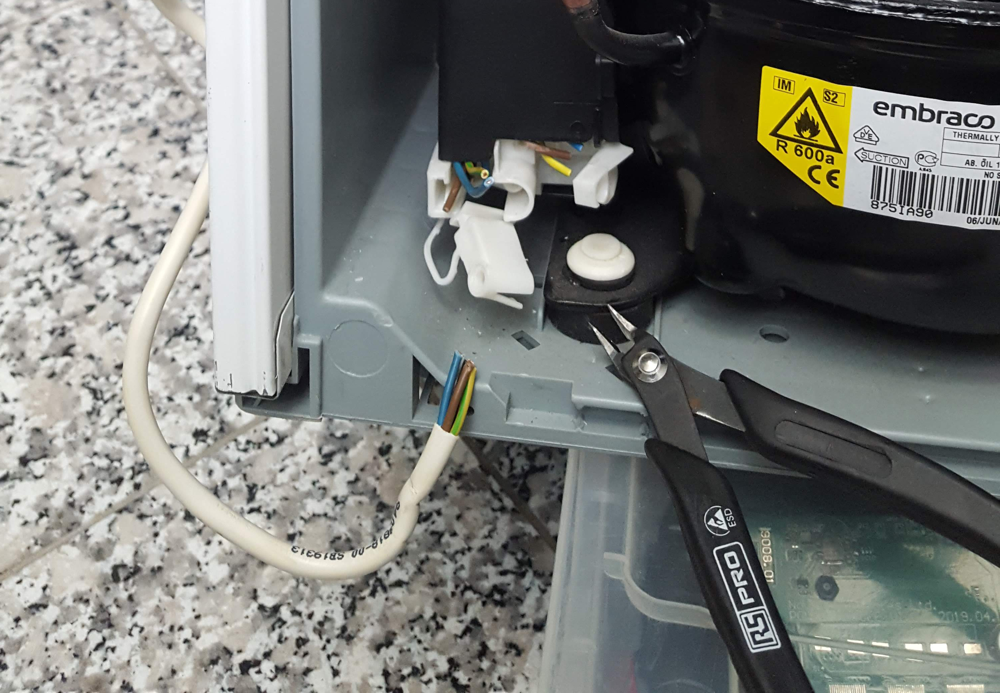
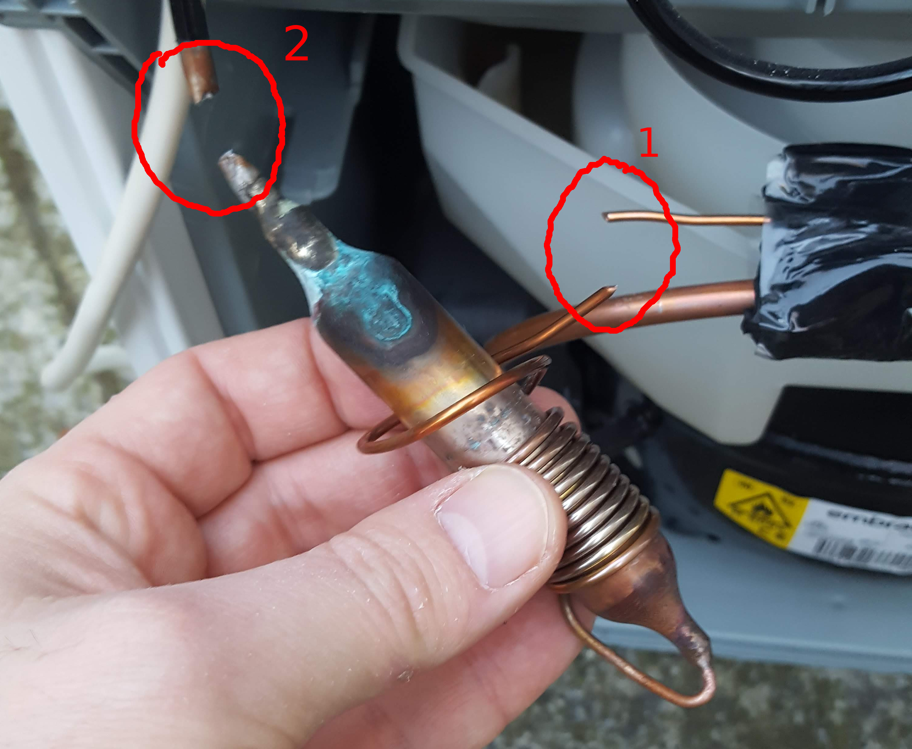
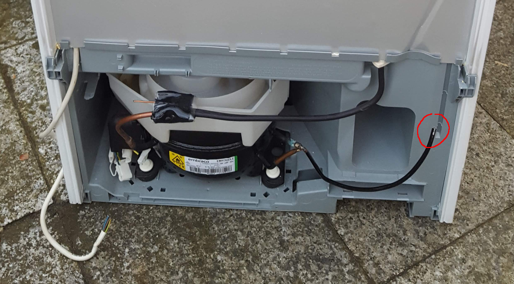
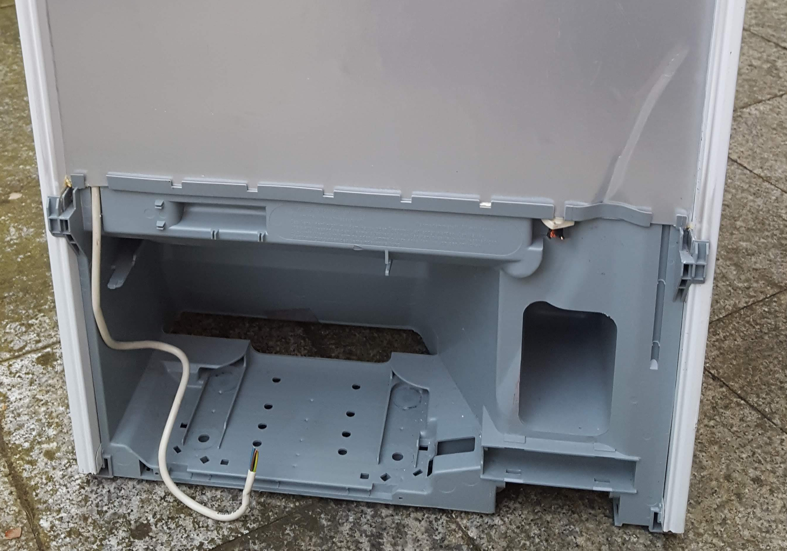
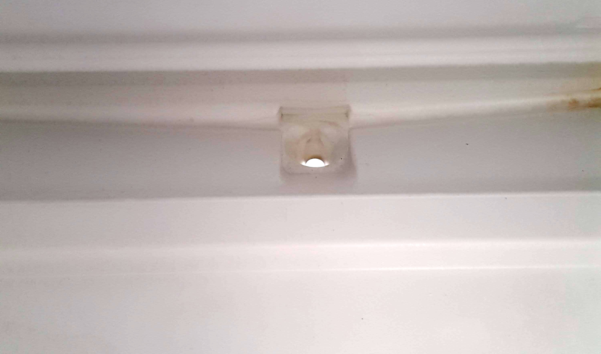
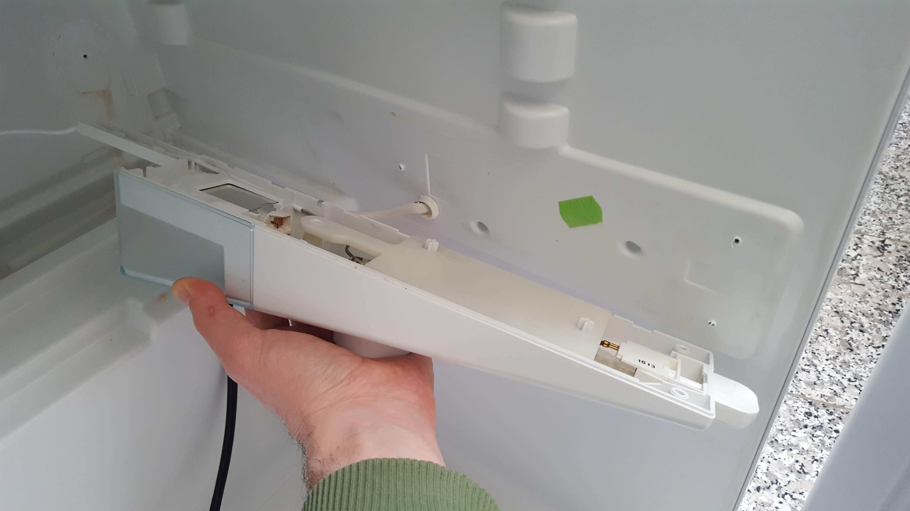
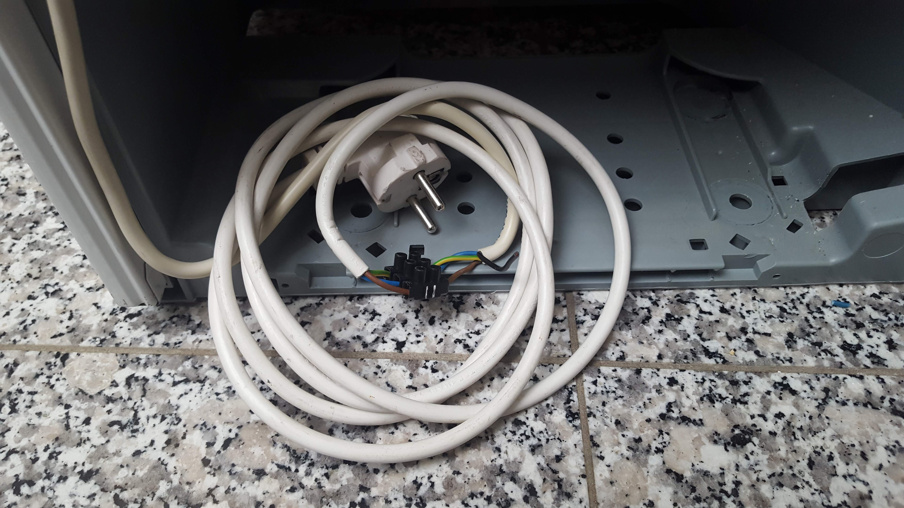
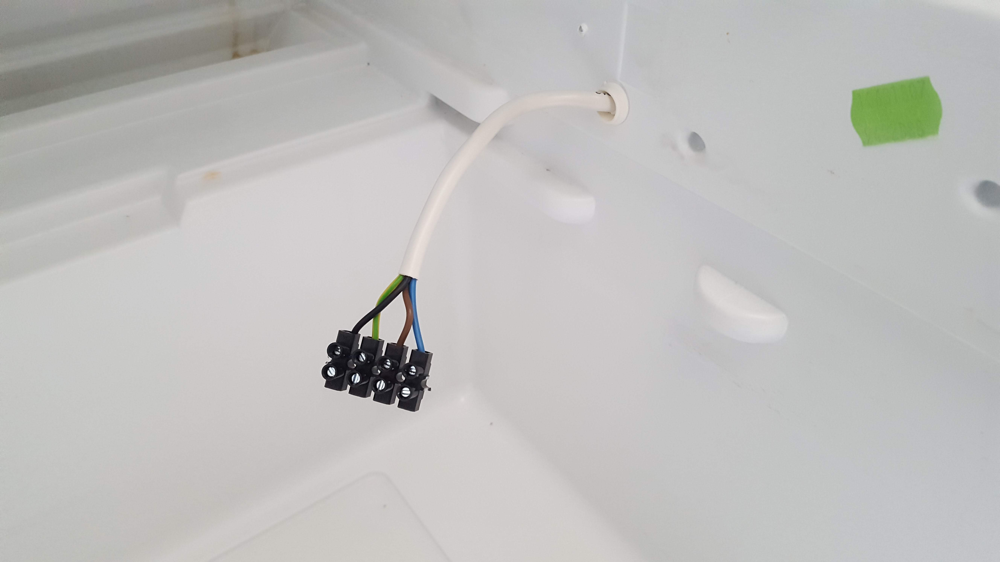

# D.I.Y. sterilization chamber 

*How to modify a refrigerator*

## Tools

* Side cutter
* Screw driver
* Knife
* Duct tape

## Preparing the refrigerator 

Refrigerators seal very good in general hence they are good candidates as a sterilization chamber. They are fairly easy to acquire as every household has one, but it can be utilized **only after a careful preparation** as in many cases it contains **flammable gas!** ​​

:warning:**Please follow [this link](https://www.kth.se/en/2.2145/energiteknik/forskningsavdelningar/ett/projekt/koldmedier-med-lag-gwp/low-gwp-news/nagot-om-koldmediers-brannbarhet-1.575938) to learn more about the refrigerant in your device before proceeding.** :warning:

### Remove the electric plug

Find the distributor box ( probably near the compressor ), pull the cables out so that you can see their color codes ( if possible ) then cut them one by one. Don't throw out the cable with the wall plug, we are going to reuse it.

### Degassing :warning:

This step is **dangerous** as most refrigerators in Europe are filled with **R600** gas that is highly flammable. The system has to be degassed very slowly to avoid risk. Take the refrigerator outside to **open air** before continuing with this step! **Avoid any probability and proximity to open flame or sparks at all times during the degassing process.**

1. Find a cartridge shaped gas puffer that has - usually - a thinner copper tube coiled around it.
2. **Cut the thin copper tube and step aside until you don't hear it hiss anymore.** *( marked as 1st )*
3. Now cut the thicker copper tube connected to the cartridge *( marked as 2nd )*
4. After this you can cut any other copper tubing wherever you want.

### Remove the cooler plate

Cut the remaining tubing that connects the cooler plate. Remove the screws or patents that hold the cooler on it's place and get rid of the plate.

### Remove the compressor

Now that the cooler plate gone, cut the last copper tube that connects the compressor. Remove screws or patents holding it in it's place, then remove the compressor.

### Seal the sinker hole

Every refrigerator has a hole to allow the damp to drip down. **This has to be sealed!** Use silicone or duct tape to seal it.

### Remove the switch and light

There is usually a switch and a light bulb inside the icebox that leaves us an opportunity to use it's wiring to power the ozone generator without drilling a hole into the fridge. *( The switch could be used to disable the generator when the door has been opened, so don't throw it away. )* Remove the whole pack.

## Rewiring

### Prepare the wall plug

Use screw terminal block to connect the three wires of the wall plug cable to the three wires of the light cable, maintain color coding. The ozone generator requires a properly grounded connection.

### Add internal terminals

Now add screw terminals to the internal end of the same cable. *( Note: there is sometimes an extra black wire for the switch, just ignore it for now. )*

