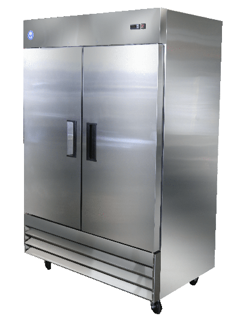

# Sterilization chamber

## Off the shelf cabinets

**Requirements:**

* Preferably stainless steel
* Hermetically seal-able

## Refrigerators

Refrigerators seal very good in general hence they are good candidates as a sterilization chamber. They are fairly easy to acquire as every household has one, but it can be utilized **only after a careful preparation** as in many cases it contains **flammable gas!** 

[Here is how to modify one.](refrigerator.md)