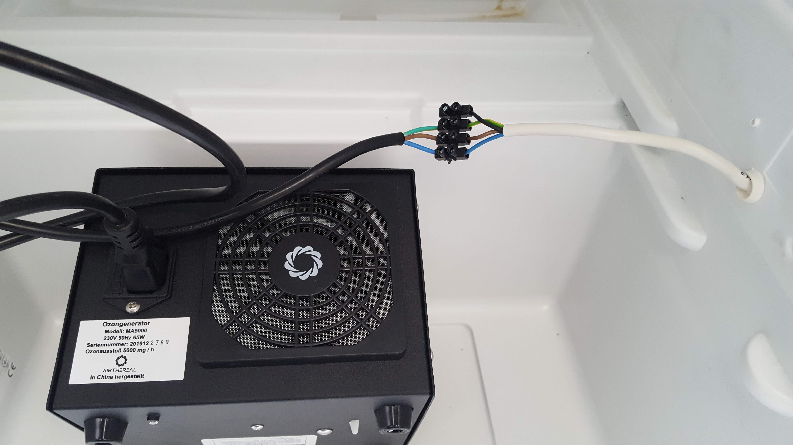
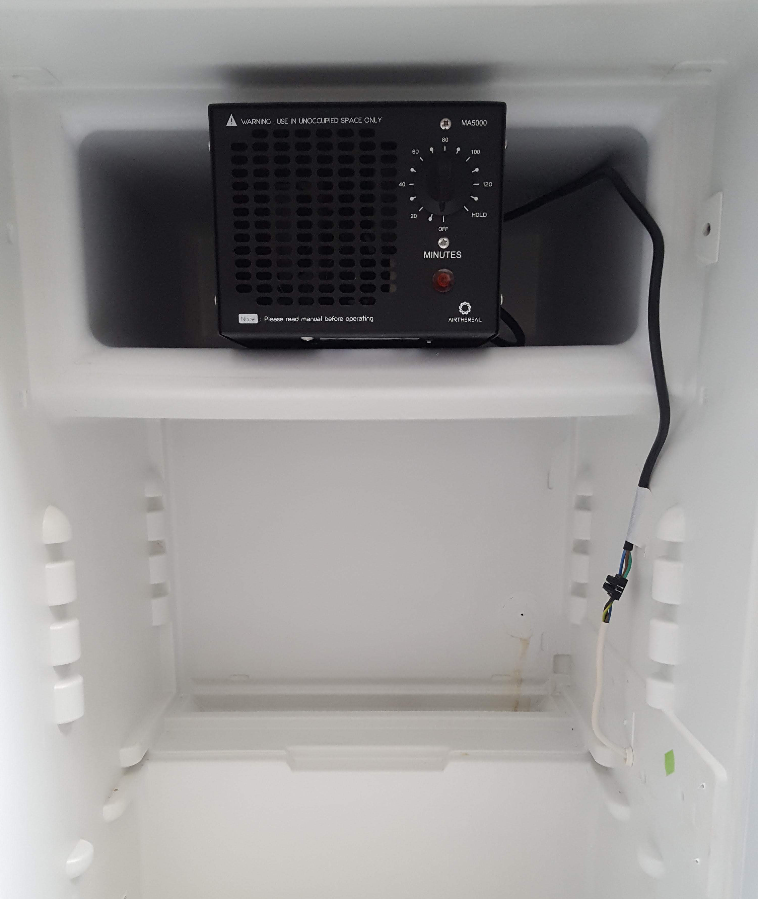
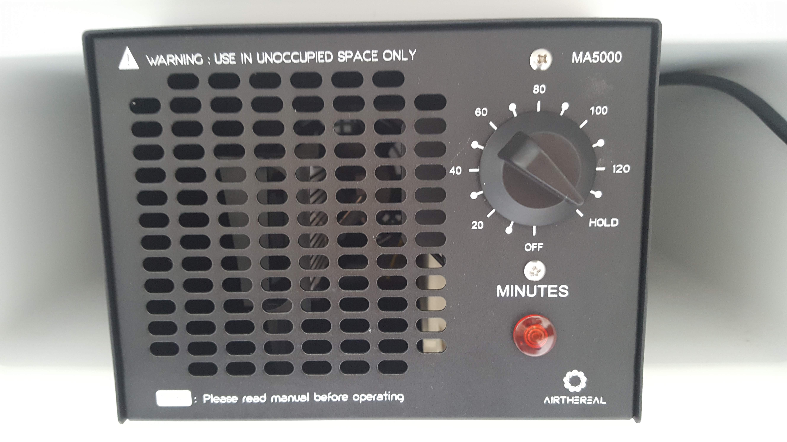
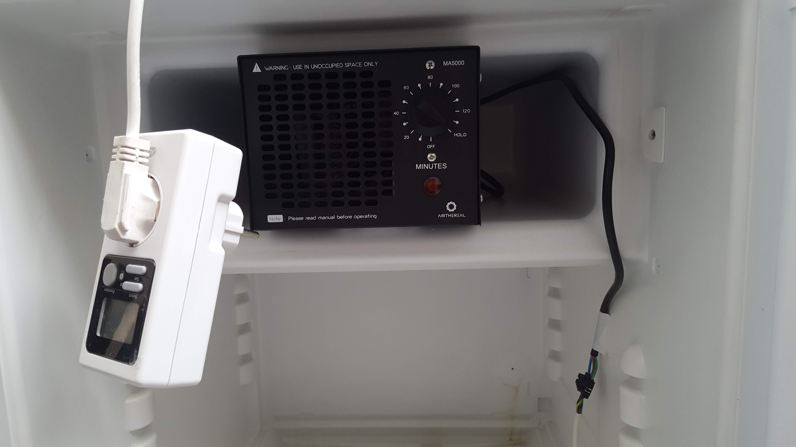

# How to build a sterilizer blazing fast

:warning: These instructions are for emergency situations, where all off-the-shelf components are at hand and there is very short time to produce a working sterilizer. In any other case please build one that has an ozone detector based process controller.

## Components

* Refrigerator
* Ozone generator
* Timer switch
* Screw terminal block

## Tools

* Side cutter
* Screw driver
* Knife
* Duct tape

## Preparing the refrigerator 

Refrigerators seal very good in general hence they are good candidates as a sterilization chamber. They are fairly easy to acquire as every household has one, but it can be utilized **only after a careful preparation** as in many cases it contains **flammable gas!** ​​

:warning:**Please follow [this link](https://www.kth.se/en/2.2145/energiteknik/forskningsavdelningar/ett/projekt/koldmedier-med-lag-gwp/low-gwp-news/nagot-om-koldmediers-brannbarhet-1.575938) to learn more about the refrigerant in your device before proceeding.** :warning:

### Remove the electric plug

Find the distributor box ( probably near the compressor ), pull the cables out so that you can see their color codes ( if possible ) then cut them one by one. Don't throw out the cable with the wall plug, we are going to reuse it.

### Degassing :warning:

This step is potentially **dangerous** as most refrigerators in Europe are filled with **R600** gas that is highly flammable. The system has to be degassed very slowly to avoid risk. Place the refrigerator in a perfectly ventilated room or take it outside to open air before continuing with this step!

1. Find a cartridge shaped gas puffer that has - usually - a thinner copper tube coiled around it.
2. **Cut the thin copper tube and step aside until you don't hear it hiss anymore.** *( marked as 1st )*
3. Now cut the thicker copper tube connected to the cartridge *( marked as 2nd )*
4. After this you can cut any other copper tubing wherever you want.

### Remove the cooler plate

Cut the remaining tubing that connects the cooler plate. Remove the screws or patents that hold the cooler on it's place and get rid of the plate.

### Remove the compressor

Now that the cooler plate gone, cut the last copper tube that connects the compressor. Remove screws or patents holding it in it's place, then remove the compressor.

### Remove the switch and light

There is usually a switch and a light bulb inside the icebox that leaves us an opportunity to use it's wiring to power the ozone generator without drilling a hole into the fridge. *( The switch could be used to disable the generator when the door has been opened, so don't throw it away. )* Remove the whole pack.

## Rewiring

### Prepare the wall plug

Use screw terminal block to connect the three wires of the wall plug cable to the three wires of the light cable, maintain color coding. The ozone generator requires a properly grounded connection.

### Add internal terminals

Now add screw terminals to the internal end of the same cable. *( Note: there is sometimes an extra black wire for the switch, just ignore it for now. )*

### Prepare generator cable

Now repeat the step with the cable provided for the generator, and connect it to the terminals inside the fridge. Make sure it's long enough to place the generator anywhere you planned.

### Install the generator

Place the generator so that neither the intake for it's fan nor the exhaust panel is blocked. 

### Seal the sinker hole

Every refrigerator has a hole to allow the damp to drip down. **This has to be sealed!** Use silicone or duct tape to seal it.

## Using the emergency sterilizer

:warning: Please use this device only if you are sure that you can vent the room frequently, as without precise controller there is going to be excess ozone gas in the container on the end of each sterilization cycle. Follow procedure and do not exceed MAC exposure. **MAC = 0.06 PPM for 8 hours a day, 5 days a week.**

### Enable continuous generator operation

Most generators' - that have analogue timer built in - continuous operation can be enabled, by selecting the "hold" function on their dial. If you are using a more precise timer, or an ozone controller you should enable this function on the generator. ( If there is no such dial, then the device is probably already in continuous operation mode. If there is no "hold" function on the dial, the device has to be disassembled and the timer switch has to be shorted. )

### Preparations

:warning: **Use our [volume to treatment time converter tool](http://nowtech.cloud/closed_calc.html) to figure out the timing protocol.** For smaller containers and large generators meant for room sized air purification the treatment times are going to be under a minute.

:warning: Most timer switches embedded into the generators are not able to do sub-minute timing. **You have to connect the system through a digital or analogue timer switch that is able to do the precise time switching.**

### Usage

**:warning: Disinfection protocols are not finalized yet :warning:**

1. Make sure that the device is not in operation, and the room has sufficient ventilation.
2. Place the items to to be disinfected into the chamber.
3. Close the door.
4. Set [treatment time](http://nowtech.cloud/closed_calc.html) and start procedure.
5. Wait at least 15 minutes before opening the chamber again.